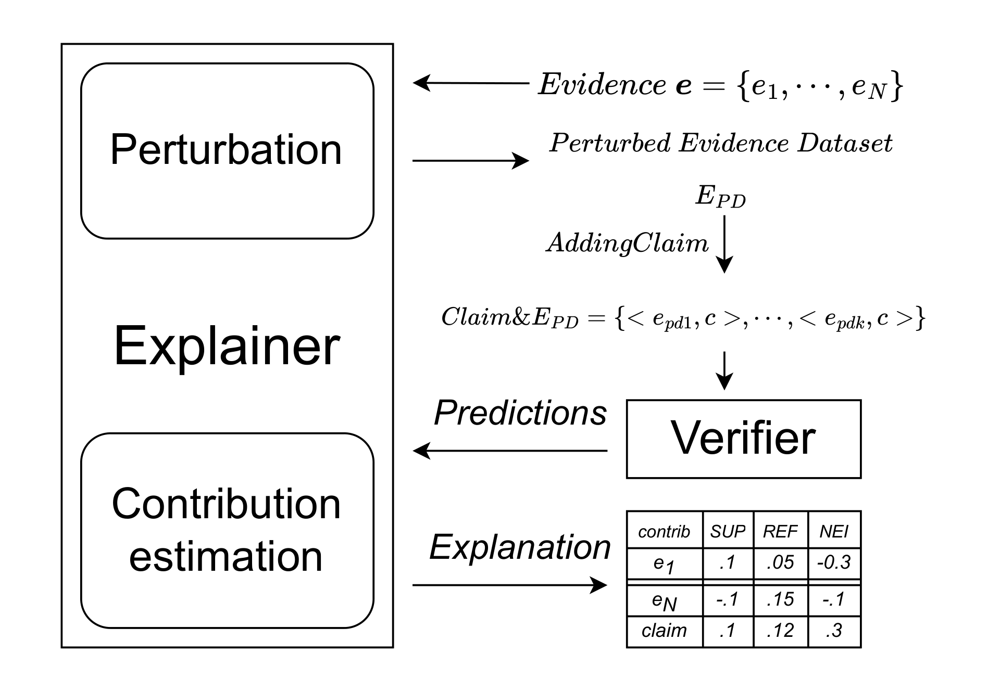

This is the code repository that developed the systems and the experiments for the paper:

## Explaining The Role of Evidence in Data-Driven Fact Checking

Fact-checking is crucial for combating misinformation, and computational methods are essential for scalability. The most
effective approaches leverage neural models that use domain-specific evidence to validate claims. However, these models
often act as black boxes, providing labels without explaining the rationale behind their decisions. Our study evaluates
whether existing explainable AI (XAI) methods, such as LIME and SHAP, can clarify model decisions and classify evidence
relevance across four established datasets. We examine three distinct fact-checking systems, highlighting that our
approach can explain all of them. In some instances, the quality of explanation provided by these post-hoc methods
surpasses the original explanations offered by intrinsic explainers within the models. Our findings show that these
post-hoc methods can effectively demonstrate how models discern evidence that supports or refutes claims, providing
improved transparency by highlighting critical issues in the models' behavior.

### Anonymization

Googling any part of the paper or the online appendix can be considered as a deliberate attempt to break
anonymity ([explanation](https://www.monperrus.net/martin/open-science-double-blind))

# Our proposal



The figure shows our framework
to understand the _contribution_ of each evidence in predicting the label for a claim.
It adapts a local post-hoc explainer (LIME and SHAP in our study) to evidence and claim.
Local post-hoc explainers rely on "variations" of the input to compute the contributions of the features
(every example's evidences) in the decision (for a claim).
In our framework, a perturbed dataset is generated for the example by removing pieces of evidence.

The explainers use the predictions of the verifier over the perturbed dataset coupled with the original claim
to build the explanation. It assigns for each example a contribution to each feature (evidence)
and to an _intercept_, defined as the average difference between the overall prediction
and the total contribution of all individual evidences in the perturbed dataset.
This can be interpreted as the contribution that the explainer attributes to the claim
within the context provided by the evidence.

The prediction is thus approximated expressed as a function of the contributions defined by the explanation:

$$Pred \approx \sum_{i=1}^{N} \text{contribution}(e_i) + \text{Intercept}$$

where contribution( $e_i$ ) (contribution of evidence $i$ ) is the contribution over the model
prediction detected by an explainer for an evidence.

## Experiment Overview

This study explores various fact-checking models, datasets, and methods for injecting noise into the evidence set. We
detail the configurations of models and explainers used in the experiments.

## Datasets

We use four main fact-checking datasets, each consisting of human-written claims, labels, and golden evidence. The
datasets include:

1. **Feverous**: An extension of the Fever dataset with more complex claims. Evidence includes both textual and tabular
   data from Wikipedia. Variants:
    - **Fev.3L**: Includes the "Not Enough Information" label.
    - **Fev.2L**: Excludes the "Not Enough Information" label.

2. **SciFact**: Contains expert-written claims with evidence sourced from scientific papers (textual evidence only).

3. **FM2**: Collected from an online multiplayer game. Claims are user-written from Wikipedia evidence. No "Not Enough
   Information" label.

4. **AVeriTeC**: Features real-world claims verified with web evidence. Each claim is paired with question-answer pairs
   supported by online content. A fourth label, "Conflicting Evidence/Cherry-picking," is present but not reported in
   our results.

## Controlled Noisy Evidence

We inject noise into the evidence sets to test model robustness. Golden evidence is mixed with noisy evidence, either
retrieved automatically or added manually. Noise addition methods include:

- **Feverous**: Retrieve 5 documents per claim, with 5 sentences and 3 tables per document. Gold evidence is often
  missing after retrieval.
- **SciFact**: Add up to 20 sentences from distractor abstracts.
- **FM2**: Players use 1-2 sentences as claims from a 10-sentence evidence list; the rest is used as noise.
- **AVeriTeC**: Add an average of 5.5 irrelevant question-answer pairs from a generator.

## Models and Training

We fine-tune three models on their respective datasets to predict veracity labels based on the claim and retrieved
evidence:

1. **RoBERTa**: A transformer-based model fine-tuned on NLI datasets. Trained for:
    - 1 epoch on Feverous and AVeriTeC.
    - 3 epochs on FM2 and SciFact.

2. **GFCE**: A veracity prediction model based on DistilBERT. Trained for:
    - 3 epochs on FM2, Feverous, and SciFact.
    - 2 epochs on AVeriTeC.

3. **LLM-Prompting (LLaMa 3.1 70B)**: A large language model using prompts to predict veracity and provide explanations.
   Inference time is reduced by simplifying the prompt, achieving similar accuracy with 75% less running time.

## Explainers Configuration

We use **LIME** and **SHAP** to explain model predictions. Perturbation sample configurations:

- **GFCE and RoBERTa**: 500 samples per explanation.
- **LLaMa**: 100 samples due to high computational cost.

We limit the analysis to datasets with examples under 512 tokens and sample up to 1,000 examples per dataset.

# API

**Python Interface**
You can define the experiment settings in the form of a Python dictionary and use one of the following
Python functions to run experiments:

1. You can define and organize your experiment configurations in a python module as a list of dictionaries
   each representing in an experiment set of settings. **This is the reccommended interface.**
   You can create your own file or use the default at `explainable_fact_checking.experiment_definitions`).

Here is an example of how to define an experiment configuration:

```python
experiment_definitions = [
    dict(experiment_id='sk_f_jf_1.0',
         results_dir='results_dir',
         random_seed=[1],

         # model params
         model_name=['default'],
         model_params=dict(model_path=['model_dir/model_name']),  # [, param1=[v1, v2]]

         # explainer params
         explainer_name=['lime'],
         explainer_params=dict(perturbation_mode=['only_evidence'], num_samples=[500]),

         # dataset params
         dataset_name='feverous',
         dataset_params=dict(
             dataset_dir=['dataset_dir'],
             dataset_file=['file1.jsonl', 'file2.jsonl'],
             top=[1000]),
         )
]
```

Then to run the experiments you
use `explainable_fact_checking.experiment_routine.ExperimentRunner.launch_experiment_by_id`
E.g.:

``` python
from explainable_fact_checking.experiment_routine import ExperimentRunner

if __name__ == '__main__':
    exp_runner = ExperimentRunner() 
    exp_runner.launch_experiment_by_id('exp_id.1')
```

if you want to run the experiments with your personal configuration file, you can specify  
the path to the file in the `launch_experiment_by_id` function in `config_file_path` parameter.
E.g.:

``` python
# as before, but in the main use.
    exp_runner.launch_experiment_by_id('exp_id.1', config_file_path='path/to/your/config_file.py')
```

2. `fairnesseval.run.launch_experiment_by_config` let you run an experiment by passing the dictionary of parameters
   of your experiment in input.
   E.g.:

``` python
from explainable_fact_checking.experiment_routine import ExperimentRunner
    
experiment_config = dict(...) # as in the experiment configuration example

if __name__ == '__main__':
    exp_runner = ExperimentRunner() 
    exp_runner.launch_experiment_by_config(experiment_config)
```

## Experiment parameters

This table provides a clear and concise overview of the parameters and their descriptions.

| Parameter          | Description                                                                                                                                                                                                                                                  |
|--------------------|--------------------------------------------------------------------------------------------------------------------------------------------------------------------------------------------------------------------------------------------------------------|
| `experiment_id`    | ID of the experiment to run. Required. [str]                                                                                                                                                                                                                 |
| `results_dir`      | Path to save results. [str]                                                                                                                                                                                                                                  |
| `random_seed`      | List of random seeds to use. All random seeds set are related to this random seed. For each random_seed a new train_test split is done.                                                                                                                      |
| `model_name`       | List of model names. Required.                                                                                                                                                                                                                               |
| `model_params`     | Dict with pairs of model hyper parameter names (key) and list of values to be iterated (values) for the specified models in `model_name`. The cross product of the list of parameters values is used to generate all the combinations of parameters to test. |
| `explainer_name`   | List of explainer names. Required.                                                                                                                                                                                                                           |
| `explainer_params` | Dict with pairs of explainer hyper parameter names (key) and list of values to be iterated (values) for the specified models in `explainer_name`. The cross product of the parameters is used as in `model_params`                                           |
| `dataset_name`     | List of dataset loader function names. Required.                                                                                                                                                                                                             |
| `dataset_params`   | Dict with pairs of dataset hyper parameter names (key) and list of values to be iterated (values) for the specified in `dataset_name`. The cross product of the parameters is used as in `model_params`.                                                     |


