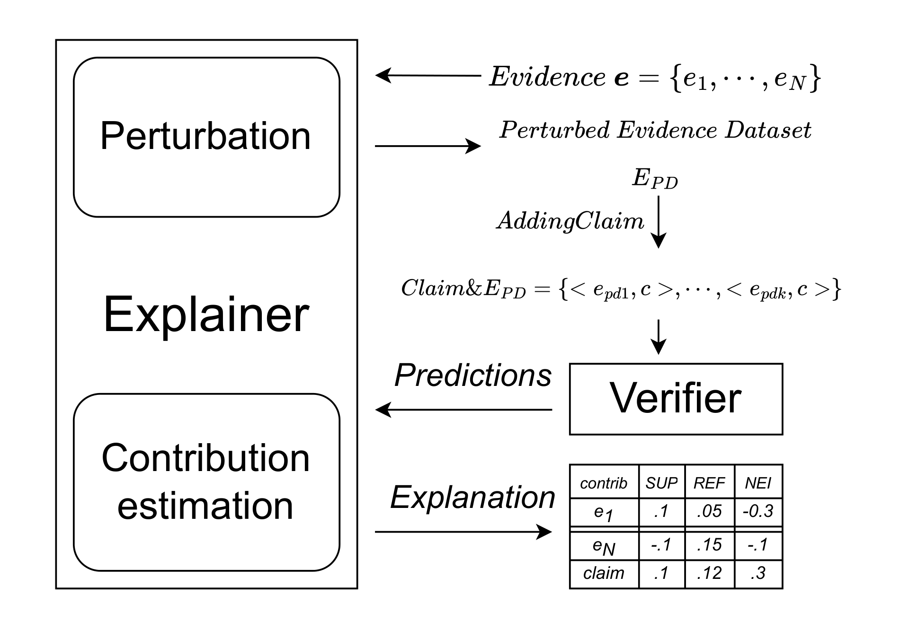

# Explainable Fact Checking
Code repository for the paper 2598 at EMNLP 2024.

# Our proposal

The figure shows our framework
to understand the _contribution_ of each evidence in predicting the label for a claim.
It adapts a local post-hoc explainer (LIME and SHAP in our study) to evidence and claim.
Local post-hoc explainers rely on "variations" of the input to compute the contributions of the features 
(every example's evidences) in the decision (for a claim).
In our framework, a perturbed dataset is generated for the example by  removing pieces of evidence. 

The explainers use the predictions of the verifier over the perturbed dataset coupled with the original claim 
to build the explanation. It assigns for each example a contribution to each feature (evidence) 
and to an _intercept_, defined as the average difference between the overall prediction 
and the total contribution of all individual evidences in the perturbed dataset.
This can be interpreted as the contribution that the explainer attributes to the claim 
within the context provided by the evidence. 

The prediction is thus approximated  expressed as a function of the contributions defined by the explanation:

$$Pred \approx \sum_{i=1}^{N} \text{contribution}(e_i) + \text{Intercept}$$

where contribution($e_i$) (contribution of evidence $i$) is the contribution over the model
prediction detected by an explainer for an evidence. 

# Data
The data used in this paper is from the FEVER dataset.
This dataset can be downloaded from the [official FEVER website](https://fever.ai/dataset/feverous.html). 
The datasets filtered by evidence type used for the experiments are stored in the `datasets` directory.

# Anonymization
Googling any part of the paper or the online appendix can be considered as a deliberate attempt to break anonymity ([explanation](https://www.monperrus.net/martin/open-science-double-blind))
